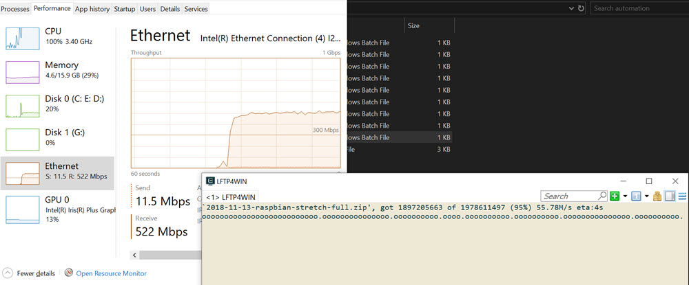

# LFTP4WIN

> A remote server administration tool that integrates WinSCP, Cygwin and VSCode.

- Simple to setup.
- Infinitely extendable and customisable.
- Portable.

[Installer](https://github.com/userdocs/LFTP4WIN)
[GitHub](https://github.com/userdocs/LFTP4WIN-CORE)
[Getting Started](README)