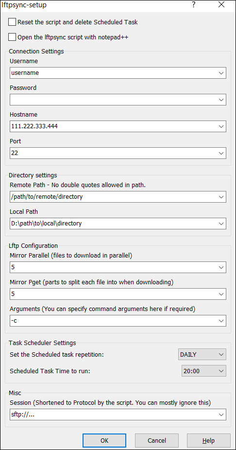

> [!warning|iconVisibility:hidden|labelVisibility:hidden] WinSCP does not have a method to load values from a file when using this custom commands. It will always load the default value unless you have defined a new default in the WinSCP options for the relevant command.

The custom commands are located in the navigation bar at the top of the WinSCP window. In order to properly use this solution you will need to understand and use these custom commands.

> [!tip|iconVisibility:hidden|labelVisibility:hidden] In WinSCP the local windows are on the left and the remote are on the right. Similar to Filezilla.

Here is brief description of the custom commands you need to understand to use this solution properly.

## notifications

This command will let you set your pushover or pushbullet api settings for notifications.

This command has some options you can set.

## open-lftp-conf

This command opens the main `lftp.conf` file in the  included notepad ++ for editing. Modifications to this file will apply global lftp settings that will take effect in a new local or remote terminal.

> [!note|iconVisibility:hidden|labelVisibility:hidden] The `mirror-to-local` and `pget-to-local` commands will have certain settings overridden when configured using the `lftp-conf-override` command but these settings are not globally applied to lftp.

## lftpsync-setup

This custom command will generate the `lftpsync-config.sh` settings for the currently visited local and remote directories and create a scheduled task. If used again it will update all settings. It can be used to reset the `lftpsync-config.sh` script and remove the scheduled task.

This command has some options you can set.

## lftp-conf-override

This custom command edits a file using specified options. Use this to set per command settings that will override the `lftp.conf` defaults when the custom `mirror-to-local` or `pget-to-local` commands are used. They do not apply globally to lftp.

This command has some options you can set.

If the `Lftp Script Options` script settings are blank or set to `0` by default meaning the `lftp.conf` is used until they are manually set.

## mirror-to-local

This command will mirror your selected directory in the lower right remote window of WinSCP to local downloads directory in the in the lower left panel of WinSCP.

This command has some options you can set.

## pget-to-local

This command will pget your selected file in the lower right remote window of WinSCP to local downloads directory in the in the lower left panel of WinSCP.

This command has some options you can set.

## queued-jobs

This command lets you see the queued commands in the jobs file.

## iperf3

Uses this script <https://git.io/fjRIi> to install iperf3 on your remote server and configure it. It will then load via the default terminal and loads the local `iperf3.sh` script to run a test using iperf3 and then generate a report using mtr. The output of the console is logged to `help/report/report-sessioname.txt`

This command has some options you can set.

## lftp

Advanced: This will connect to the remote directory and list all files and folders with lftp. The local directory will be same as the WinSCP local directory at the point of connection. This command is mostly used for debugging and testing but provides functional usage of lftp via the command line.

This command has some options you can set.

## OpenSSH

Open a terminal session and connect to the remote host using OpenSSH - `ssh-pageant` loaded automatically for key file authentication.

This command has some options you can set.

## Terminal

Open a local terminal session with `ssh-pageant` loaded. Your home directory is located in the root of the solution.

This command has some options you can set.

## Custom command configuration

Some commands have options available that change their behaviour. You can access the custom command option in the WinSCP preferences menu.

## SSH access using Kitty

WinSCP has a specific button that has been configured for kitty integration. Just click the button shown in the image below to do this.

> [!note|iconVisibility:hidden|labelVisibility:hidden] The integration of OpenSSH via Cygwin using the `OpenSSH` custom command provides a more complete experience.

## Queuing explained

Queuing works when a transfer is already in progress. In WinSCP navigate to the local directory and remote directory or file and use the `mirror-to-local` or `pget-to-local` command again. It will ask you if you want to queue the transfer and automatically initiate it once the previous transfer has completed. It does this by adding a transfer commands to a watched file called `jobs.sh`.

You can queue jobs for different local directories and remote files or directories across different WinSCP sessions by navigating to the required files or locations before using the `mirror` or `pget` commands again.

If you use an post processing extension for `lftpsync.sh` or `mirror-to-local.sh` they will run after each queued command is processed.

## Notifications using Pushbullet or Pushover

## For Pushbullet services

If you don't have an account go make one here <https://www.pushbullet.com/>

Then you need to visit this URL to generate an API key: <https://www.pushbullet.com/#settings/account>

## For Pushover services

If you don't have an account go make one here: <https://pushover.net/login>

Then you need to visit this URL to create a new application to generate an API key: <https://pushover.net/apps/build>

You can find your user key here: <https://pushover.net/>

Once you have created an account with either or both services you need to use the `notifications` custom command in a WinSCP session to enter and save your API details.

Once you have done that you will get a Pushbullet or Pushover notification to your devices when either a mirror, pget or sync task completes.