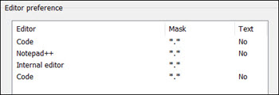
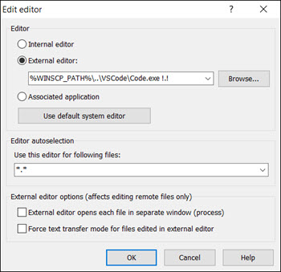

The local terminal currently these installer functions. These functions are in the `/system/etc/bash.bashrc`

## install_vscode

`install_vscode` will download the latest VSCode portable release and install it to `/applications/VSCode`

These extensions are installed automatically by the function:

```bash
foxundermoon.shell-format
yzhang.markdown-all-in-one
vscode-icons-team.vscode-icons
```

When configuring your VSCode `settings.json` to work with local binaries use this format since the `execpath` is relative to this directory:

```bash
/applications/VSCode/bin
```

For example to use Cygwin bash with the VSCode terminal we do this:

```json
"terminal.integrated.profiles.windows": {
    "bash": {
        "path": "${execPath}\\..\\..\\..\\bin\\bash.exe",
        "args": [
            "--login",
            "-i"
        ]
    }
},
```

This is loading `/bin/bash.exe` relative to `/applications/VSCode/bin`

### enable the vscode internal editor

`install_vscode` will install VSCode portable to the `/applications/VSCode` directory. This will immediately work with the WinSCP internal editor `code`

> [!tip|iconVisibility:hidden|labelVisibility:hidden|style:callout] WinSCP also has a native internal editor for `code`. The LFTP4WIN editor should be the nearest to the top.



To check you can double click on the editor to see it matches the configuration in this image.



## install_git

`install_git` this will install git portable for windows to `/applications/git`

To point to our git binary we use this

```json
"github.gitCommand": "${execPath}\\..\\..\\git\\bin\\git.exe",
```

This is loading `/applications/git/git.exe` relative to `/applications/VSCode/bin`
