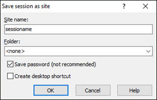
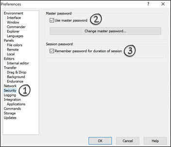

> [!note|iconVisibility:hidden|labelVisibility:hidden] Installation is documented in the readme for the deployment tool used to install the LFTP4WIN solution - [LFTP4WIN](https://github.com/userdocs/LFTP4WIN)

Inside the main folder of a completed `LFTP4WIN` installation you see these main files once the install is complete.

`Double Click Me - WinSCP Startup.cmd` -Loads your key files in the `/keys` folder and starts WinSCP.

`LFTP4WIN-import.cmd` - Imports your settings from a previous release starting from version `LFTP4WIN` (V2 only)

`LFTP4WIN-terminal.cmd` - Opens a new local terminal session with key files loaded in the session.

`LFTP4WIN-update.cmd` - Updates Cygwin and the LFTP4WIN CORE files - Your configuration files will not be reset.

## Configuring WinSCP

Run the `Double Click Me - WinSCP Startup.cmd` in the main directory of this solution and it will load WinSCP and any `ppk` format key files in the `keys` directory.

Once WinSCP is loaded you are shown a session manager with a configured template session called `sessionname`.

All you need to do is edit this session to use your server connection details and save it as a new session.

### Password authentication (easiest solution with the least configuration)

There are some conditions to successfully using a password.

> [!attention|iconVisibility:hidden|labelVisibility:hidden] **Critical note:** Passwords Golden Rules!

**1:** Do not use double quotes `"` or things will break.

**2:** Make sure the password does not end with a `\` or things will break.

**3:** Single quotes can be used and are escaped.

A password like this will work perfectly across the entire solution and all extensions of it, like portable kitty.

```bash
DSref352YjeuakdueW
```

A password like this will work with the custom commands and lftp but won't work with kitty and WinSCP integration - (I tested this password)

```bash
¬`!£$%^&*()_-+={[}]~#:;@'<,>.?/|\}
```

When you edit the template session in WinSCP by providing a password for authentication you will have a pretty straightforward experience, assuming your followed the golden rules. WinSCP, Kitty and lftp will work with no further configuration required.



> [!tip|iconVisibility:hidden|labelVisibility:hidden] You can also configure a master password to protect your login:



If you don't need to use a private key to authorize your connection you can move on the [commands](#commands) section and skip the next section.

### Private key authentication

> [!tip|iconVisibility:hidden|labelVisibility:hidden] Please read this [guide](https://www.ssh.com/ssh/putty/windows/puttygen) for using puttygen import or create key files.

All you need is to have your key file in the Putty format. You can create a new PPK format key using `puttygen`. It can also load and export an OpenSSH format key to the ppk format.

> [!note|iconVisibility:hidden|labelVisibility:hidden] Loading too many keys from the `keys` folder may result in authentication errors. I suggest you keep it simple and only have a few unique keys here relative to your sessions.

**1:** You need to place the Putty format key in your `Keys` directory.

```text
Keys/mykeyname.ppk
```

**2:** The run the `Double Click Me - WinSCP Startup.cmd` to load all `ppk` keys in the `Keys` directory. If they are password protected you will need to enter this when prompted.

That is all. Your key will automatically be passed to lftp by the script.

### How key file authentication works

The `Double Click Me - WinSCP Startup.cmd` checks the `keys` folder for `ppk` format keys and automatically loads them into kageant.

`kageant` will provide the key for authentication with WinSCP and Kitty when authorizing to a server.

`ssh-pageant` will use communicate with kageant to provide authentication in ConEmu when it is loaded for lftp and other uses.