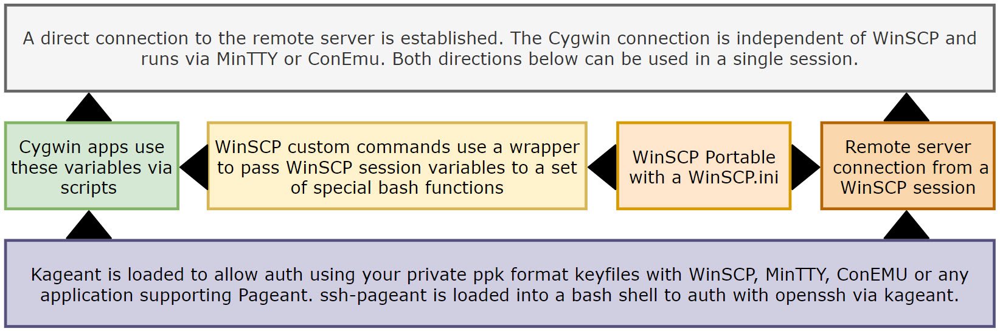

`LFTP4WIN-CORE` is a solution to the problem of using [lftp](https://lftp.yar.ru/) in an easy and user friendly way on Windows whilst achieving maximum performance. This is achieved using WinSCP, Cygwin and bash/batch scripting. The LFTP4WIN-CORE template is deployed by the [LFTP4WIN](https://github.com/userdocs/LFTP4WIN) installer and applied over a Cygwin portable installation using a specially configured and localised environment. It can be installed and run as a local user with no elevated privileges required.

To help understand the project as a whole, here is a basic diagram of the work flow and how the components interact.

A special set of bash functions used by WinSCP extensions translate WinSCP session variables into bash shell environment variables that can then be used by our Cygwin applications. By combining WinSCP extension features with bash scripting we are able to create a basic GUI experience for using lftp on Windows as well as interface with other applications like OpenSSH.

When all the parts are combined the solution becomes a powerful administrative toolbox for managing remote servers and providing access to Linux tools locally while being 100% portable and self contained.

No admin privileges required, simple to use and with a huge potential to extend functionality even further.

One login to rule them all!

> [!warning|iconVisibility:hidden|labelVisibility:hidden] **Disclaimer:** The solution works well to download with `lftp` on Windows x64 but you may experience bottlenecks from peering to your remote host or from your PC hardware and local network setup. For example, an NVME SSD will provide superior results compared to an old mechanical drive. So there is no one configuration that fits all options and you may need to tweak the default lftp settings to find the best way to leverage your current setup to its max potential. The readme should contain all the information you need to understand and configure the solution.

[How to monitor your network performance when using this solution](https://www.ghacks.net/2017/12/28/a-detailed-windows-resource-monitor-guide/)

> [!note|iconVisibility:hidden|labelVisibility:hidden] **Limitations to consider when reviewing results**: Physical hardware of your device - Lftp can be CPU and disk heavy so factor this into to your expectations of peak performance.
>
> Peering with remote server - Use the `iperf3` command to generate a report.
>
> Local network setup - I don't know your the details of your network setup unless you specifically provide those details for assistance when trouble shooting.
